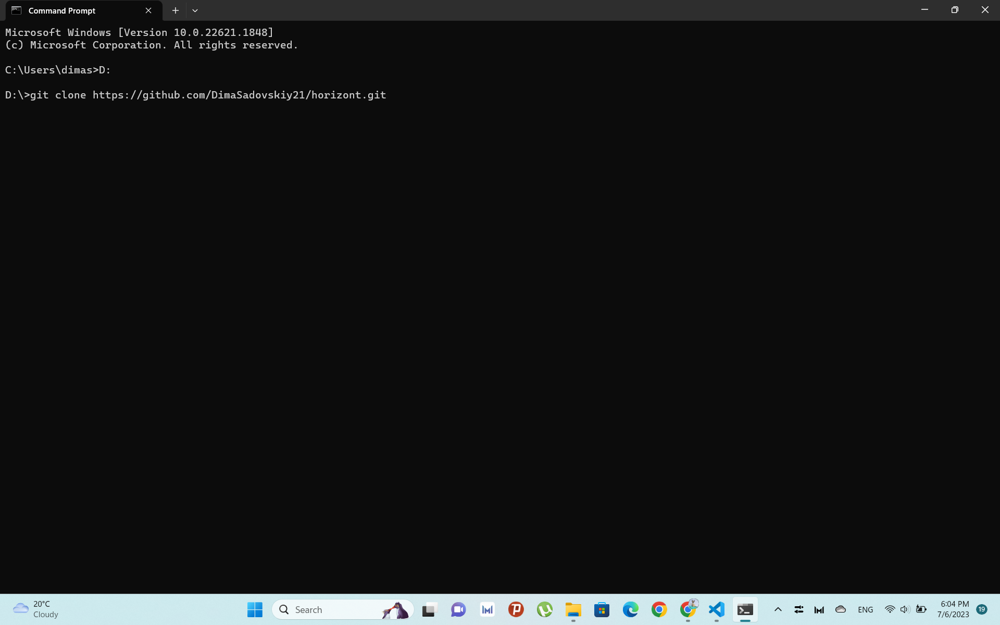
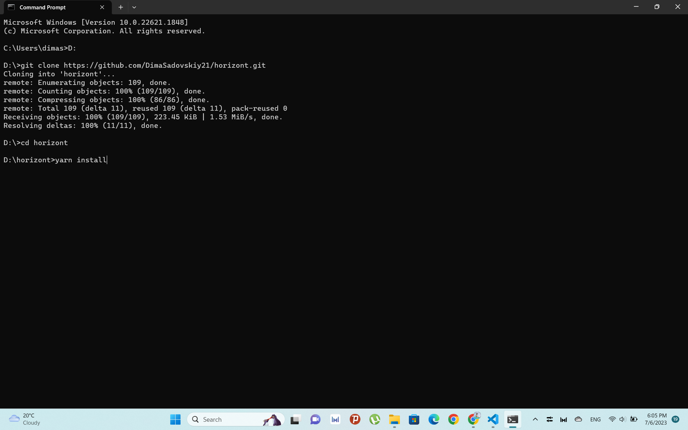
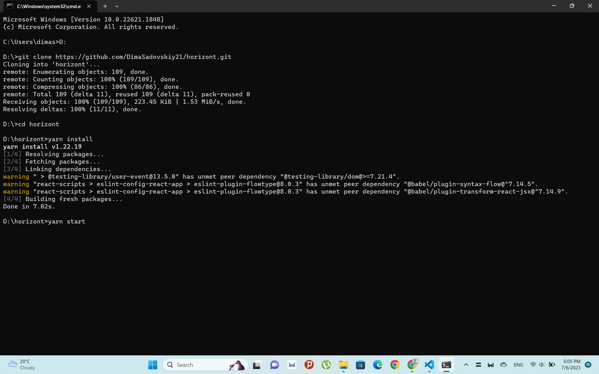
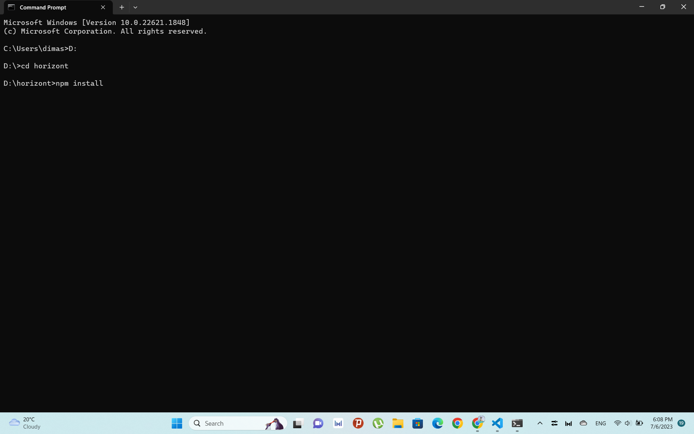
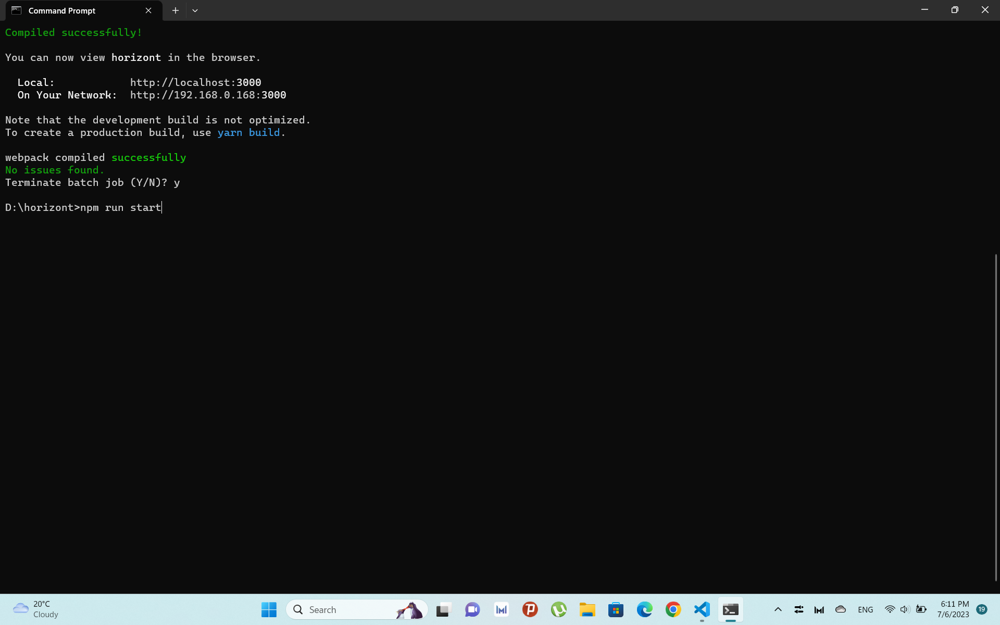

1) Клонировать проект с Github (git clone https://github.com/DimaSadovskiy21/horizont.git);

2) В директории проекта выполнить команду yarn install и дождаться окончания выполнения команды;

3) В директории проекта выполнить команду yarn start;

!!!Если yarn не установлен на компьютере, то: 

2) В директории проекта выполнить команду npm install и дождаться окончания выполнения команды;

3) В директории проекта выполнить команду npm run start;
